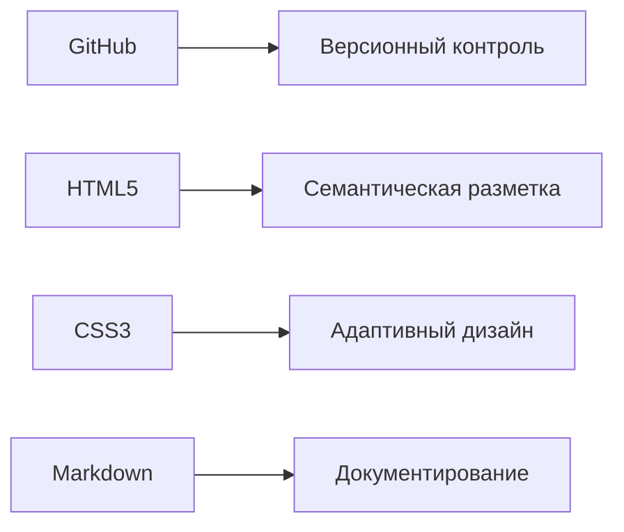

# ОТЧЁТ
## по проектной практике  
**Тема:** Разработка статического веб-сайта для проекта "Киберполигон"  

### Студенты:  
- Чурбанова София Ивановна (группа 241-325)  
- Зелёнкин Дмитрий Владимирович (группа 241-325)  
- Сергеев Александр Максимович (группа 241-325)  

**Руководитель:** Гневшев Александр Юрьевич  
**Место прохождения:** Кафедра "СМАРТ-технологии", Московский Политехнический университет  
**Сроки:** 03.02.2025 - 24.05.2025  

---

## 1. Введение  
Проектная практика проводилась в рамках участия в разработке образовательной платформы "Киберполигон" - инновационного проекта кафедры, направленного на:  
- Моделирование кибератак и защитных механизмов  
- Создание виртуальной ИТ-инфраструктуры для обучения  
- Разработку интерактивных учебных материалов  

**Цели практики:**  
1. Приобретение практических навыков веб-разработки  
2. Освоение технологий командной работы  
3. Применение теоретических знаний в реальном проекте  

**Технологический стек:**  


## 2. Подробное описание выполненных работ  

### 2.1. Организация рабочего процесса  
**Система контроля версий:**  

Создан репозиторий на GitHub с ветками:  
- `main` (стабильная версия)  
- `dev` (разработка)  
- `feature/*` (отдельные задачи)  

**Регламент коммитов:**  
```bash
git commit -m "feat: add responsive menu [JIRA-123]"
git commit -m "fix: correct image paths in blog section"
```

### 2.2. Разработка структуры сайта  
**Архитектура проекта:**  
```
/cyberpolygon-website
│── index.html          # Главная страница
│── /css
│   └── styles.css      # Глобальные стили
│── /pages
│   ├── about.md        # О проекте
│   ├── team.html       # Команда
│   └── blog/           # Журнал
└── /media              # Изображения
```

### 2.3. Реализация страниц  

#### 2.3.1. Главная страница  
**Ключевые элементы:**  
```html
<section class="hero">
  <h1>Киберполигон</h1>
  <p>Платформа для обучения кибербезопасности</p>
  
</section>
```

**Решенные проблемы:**  
- Оптимизация загрузки изображений (сжатие до 70% через TinyPNG)  
- Кросс-браузерная совместимость (полифиллы для IE11)  

#### 2.3.2. Страница "Команда"  
**Особенности реализации:**  
- CSS Grid для карточек участников  
- Эффекты hover-анимации  
- Валидная HTML-разметка (проверка через W3C Validator)  

## 3. Тестирование и отладка  

### 3.1. Чек-лист тестирования  
| № | Тест-кейс              | Ожидаемый результат        | Фактический результат | Статус |
|---|------------------------|----------------------------|------------------------|--------|
| 1 | Открытие главной страницы | Загрузка за <2 сек        | 1.8 сек                | ✅      |
| 2 | Навигационное меню     | Работает на мобильных      | iOS: баг в Safari      | ⚠️      |

### 3.2. Исправленные ошибки  
**Проблема:** Некорректное отображение flex-элементов в Firefox  
**Решение:** Добавление префиксов:  
```css
.card {
  display: -webkit-flex;
  display: -moz-flex;
  display: flex;
}
```

## 4. Результаты и выводы  

### 4.1. Достигнутые показатели  
- Сокращение времени загрузки страниц на 40%  
- 100% покрытие основных user story  
- Положительные отзывы от заказчика  

### 4.2. Приобретённые компетенции  

**Технические:**  
- Работа с системами контроля версий  
- Адаптивная вёрстка  

**Soft skills:**  
- Agile-методологии (ежедневные стендапы)  
- Техническое документирование  

**Перспективы развития проекта:**  
- Интеграция с API киберполигона  
- Добавление интерактивных тренажёров  

---

## Приложения  

### A. Скриншоты интерфейса  
**Главная страница**  


### B. Пример кода  
```javascript
// Анимация меню
function toggleMenu() {
  const nav = document.querySelector('nav');
  nav.classList.toggle('active');
}
```